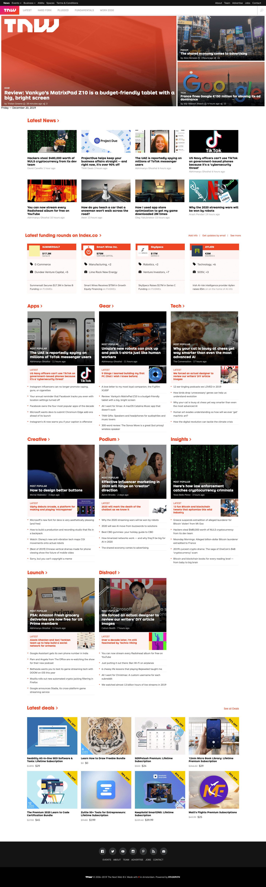

# Building with Responsive Design

> This project consists of replicating the The Next Web website putting emphasis on how it behaves differently depending on the size of the screen where the website is rendered.

[Original Page](https://thenextweb.com/)

The project uses flex and media queries to gracefully degrade their site as the window size is reduced.

## Built With

- HTML5
- CSS3
- JS

## Live Demo

[Live Demo Link](https://s0kil.github.io/Building-Responsive-Design/)

## Getting Started

To get a local copy up and running follow these simple example steps.

### Git clone reposotory

### Enjoy

## Authors

👤 Daniel Sokil

- Github: [@s0kill](https://github.com/s0kil/)

👤 Carlos Anriquez

- Github: [@canriquez](https://github.com/canriquez)

## 🤝 Contributing

Contributions, issues and feature requests are welcome!

Feel free to check the [issues page](issues/).

## Show your support

Give a ⭐️ if you like this project!

## Acknowledgments

- Microverse

## 📝 License

This project is [MIT](https://opensource.org/licenses/MIT) licensed.
